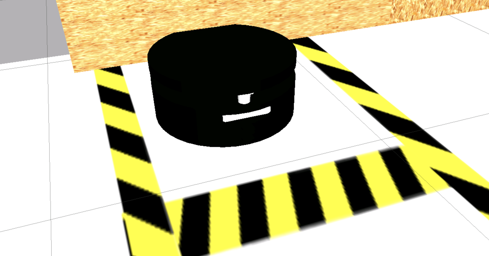

# Warehouse Project

This project focuses on designing the navigation system for a mobile robot operating within a warehouse environment. It requires to setup and configure the navigation system of the RB1 mobile robot and utilizes the `simple_comander_api` which interacts with the Nav2 system to implement various navigation routes for the robot.

  

## Structure

```text
.
├── attach_shelf
│   ├── launch
│   │   └── attach_to_shelf.launch.py
│   ├── src
│   │   └── approach_service_server_modified.cpp
│   ├── CMakeLists.txt
│   └── package.xml
├── cartographer_slam
│   ├── config
│   │   └── cartographer.config.lua
│   ├── launch
│   │   └── cartographer.launch.py
│   ├── rviz
│   ├── CMakeLists.txt
│   └── package.xml
├── localization_server
│   ├── config
│   │   └── localization.config.yml
│   ├── launch
│   │   └── localization.launch.py
│   ├── rviz
│   ├── CMakeLists.txt
│   └── package.xml
├── map_server
│   ├── launch
│   │   └── map_server.launch.py
│   ├── maps
│   ├── rviz
│   ├── CMakeLists.txt
│   └── package.xml
├── nav2_apps
│   ├── launch
│   │   └── move_shelf_to_ship.launch.py
│   ├── nav2_apps
│   │   ├── __init__.py
│   │   └── move_shelf_to_ship.py
│   ├── resource
│   ├── test
│   ├── package.xml
│   ├── setup.cfg
│   └── setup.py
├── path_planner_server
│   ├── config
│   │   ├── behavior_tree.config.yml
│   │   ├── behavior_tree.xml
│   │   ├── controller.config.yml
│   │   ├── filters.config.yml
│   │   ├── planner_server.config.yml
│   │   └── recovery.config.yml
│   ├── launch
│   │   ├── pathplanner.launch.py
│   │   └── pathplanner_real.launch.py
│   ├── rviz
│   ├── CMakeLists.txt
│   └── package.xml
└── README.md
```

## Setup

#### Distribution

Use docker for quick-start (for both ROS1 or ROS2):

```bash
# using docker for ROS1
$ docker run -ti --rm --name local-ros-noetic ros:noetic
# using docker for ROS2
$ docker run -ti --rm --name local-ros-humble ros:humble
```

#### Build (Package)

Now, create a ros2 workspace, clone the package:

```bash
# setup directory
$ mkdir ~/ros2_ws/src/
$ git clone <repo_name> ~/ros2_ws/src/
```

Install the required packages (dependency) mentioned in `package.xml` using `apt`:

```bash
# check if package is available
$ ros2 pkg list
$ ros2 node list
# update path to installed packages
$ source /opt/ros/humble/setup.bash
```

To build locally or inside docker use the following commands:

```bash
# execute build
$ cd ~/ros2_ws && colcon build
$ source ~/ros2_ws/install/setup.bash
```

## Robot

The `RB-1 BASE` mobile robot is specifically designed for indoor logistics applications, capable of carrying diverse payloads and integrating systems like robotic arms. It features localization and navigation enabling precise obstacle detection and path finding from 5 to 60 meters. This makes it highly effective for navigating complex indoor spaces and executing logistical tasks efficiently.



**Note:** Check more details about `RB-1 BASE` from [here](https://robotnik.eu/products/mobile-robots/rb-1-base-en/).

## Launch

The ROS2 navigation stack is a comprehensive system designed for autonomous robot navigation, providing tools for path planning, localization, and obstacle avoidance. The config folder contains files for navigation configuration.

- `recovery.config.yml` : Configures parameters for the behavior server managing complex navigation behaviors.
- `behavior_tree.config.yml` : Defines parameters for behavior trees used in navigation decision-making.
- `controller.config.yml` : Contains settings for the controller (local planner) responsible for executing planned paths.
- `filters.config.yml` : Specifies configurations for the filter mask used in obstacle avoidance.
- `localization.config.yml` : Configures the localization server for robot position estimation on map.
- `planner_server.config.yml` : Defines parameters for the planner (global panner) handling path planning.

```bash
# terminal 1
$ ros2 launch map_server map_server.launch.py map_file:=warehouse_map_real.yaml
```

```bash
# terminal 2
$ ros2 launch localization_server localization.launch.py map_file:=warehouse_map_real.yaml
```

```bash
# terminal 3
$ ros2 launch path_planner_server pathplanner.launch.py
```


Execute node `move_shelf_to_ship.py` arrive to the `loading_position` then pick up the cart and go to `shipping_position`.

```bash
# terminal 4
$ ros2 run nav2_apps move_shelf_to_ship.py
```

<div style="display: flex; justify-content: space-between;">
  <div style="flex: 1; padding: 5px;">
    
  </div>
  <div style="flex: 1; padding: 5px;">
    
  </div>
  <div style="flex: 1; padding: 5px;">
    
  </div>
</div>

## Specifications

#### Simple Commander API

The Simple Commander API is a user-friendly interface designed to interact seamlessly with the ROS2 Nav2 system, facilitating the creation and management of navigation tasks for mobile robots. It simplifies the process of defining and executing complex navigation routes, allowing developers to focus on higher-level robot behavior and logic.

## Roadmap

- [x] Task 1 : Create a map of the warehouse.
- [x] Task 2 : Configure Localization node.
- [x] Task 3 : Configure Navigation nodes.
- [x] Task 4 : Create a ROS2 node to navigate using `simple_commander_api`.

See the [open issues](https://github.com/llabhishekll/warehouse_project/issues) for a full list of proposed features (and known issues).

## Tools

System tool/modules used for project development.

- `Applications` : [vs-code](https://code.visualstudio.com/), [ros-extensions](https://marketplace.visualstudio.com/items?itemName=ms-iot.vscode-ros) and [docker-desktop](https://docs.docker.com/get-docker/).
- `ROS` : [ros-docker-images](https://hub.docker.com/_/ros/) (`humble`, `noetic`) or [build-source](https://www.ros.org/blog/getting-started/).

## License

Distributed under the MIT License. See `LICENSE.txt` for more information.
